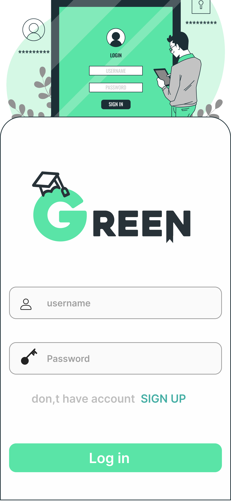
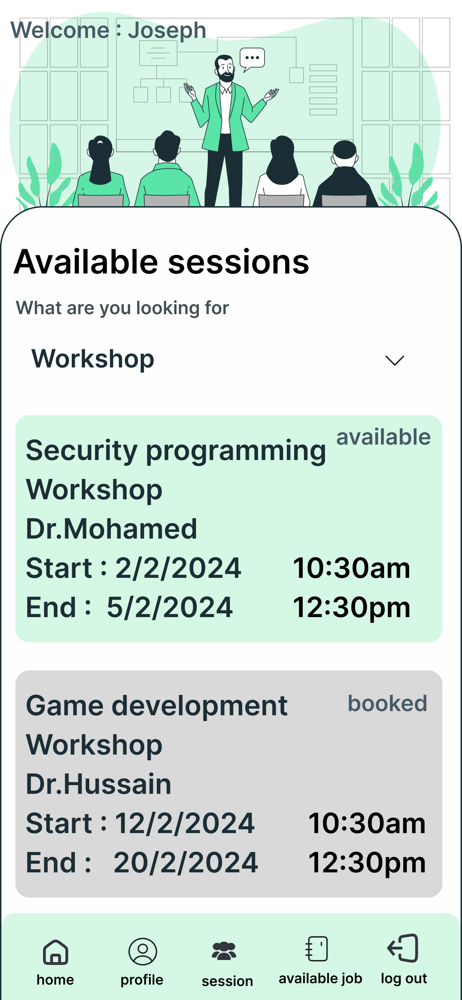
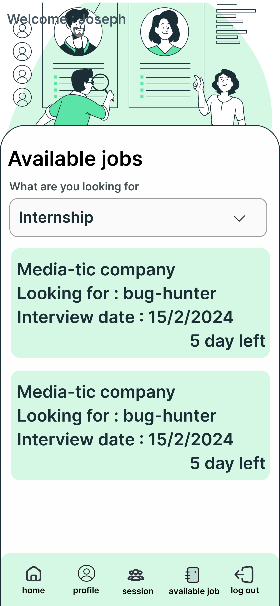
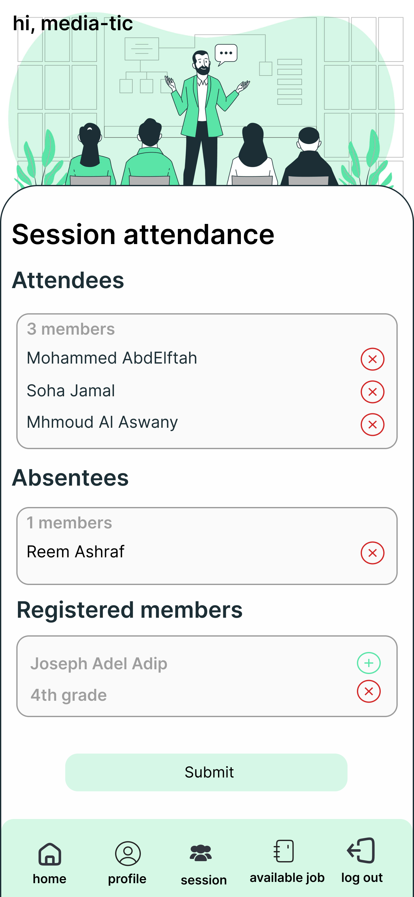
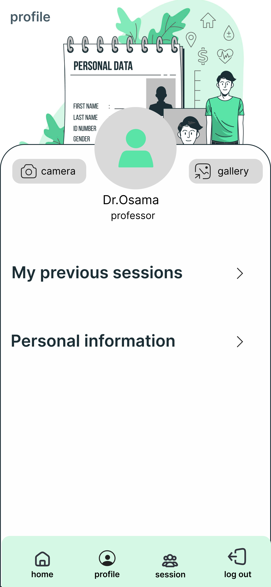
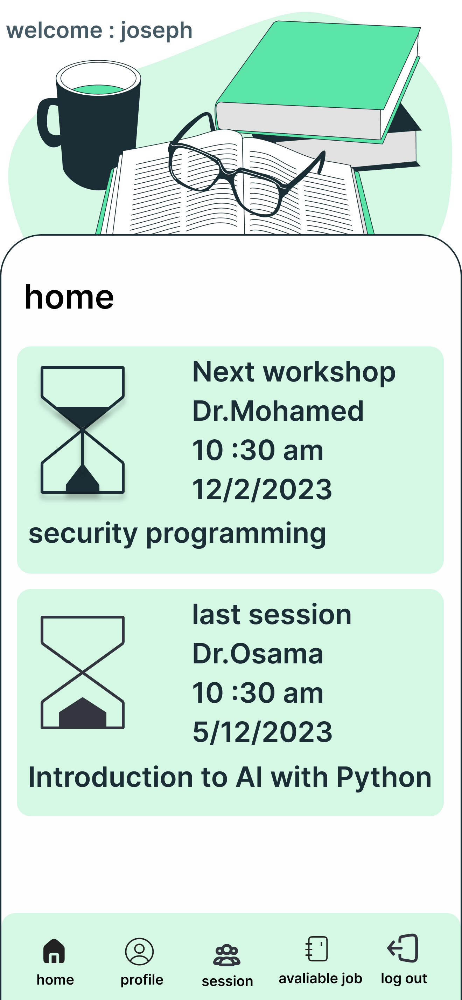

# 🌿 GREEN - Academic & Career Platform

[](https://flutter.dev/)
[](https://pub.dev/packages/get)
[](https://firebase.google.com/)
[](https://dart.dev/)
[](#-architecture--folder-structure)

**GREEN** is a comprehensive mobile application built with **Flutter** designed to bridge the gap between students, graduates, career advisors, and companies. It provides an all-in-one ecosystem for managing academic workshops, career advising sessions, job/internship applications, attendance tracking, and surveys.

---

## 📌 Features by User Role

### 👨‍🏫 1. Career Advisor / Speaker / Professor
* **Session Management:** Create, update, and manage various types of sessions (Advising, Training, Workshops, Informational).
* **Attendance Tracking:** Real-time attendance taking and status management (`TavkeAttendsForSessions`).
* **Member Requests:** View and approve/reject registration requests for hosted sessions (`registered_members`).
* **Advisor Profile:** View and update professional credentials, personal info, and achievements.

### 🎓 2. Student & Graduate
* **Job & Internship Portal:** Explore Full-Time, Part-Time, and Internship opportunities with real-time status checking.
* **Session Enrollment:** Discover upcoming sessions, register, and track session status.
* **Session History & Records:** Keep track of attended sessions, achievements, and past learning milestones.
* **Interactive Surveys:** Access career/academic surveys and receive optimal guidance answers.
* **Profile & Portfolio:** Manage academic/graduate information, personal skills, and career updates.

### 🔐 3. Authentication & Security
* **Multi-Role Onboarding:** Dedicated signup and login flows for Students, Graduates, and Career Advisors.
* **OTP Verification:** Secure phone/email verification per user type.
* **Firebase Authentication:** Seamless integration with Firebase Auth paired with custom backend REST APIs.

---

## 📱 Screenshots & Preview

<div align="center">

| User Roles & Auth | Workshops & Sessions | Jobs & Internships |
| :---: | :---: | :---: |
|  |  |  |

| Attendance Management | Career Advisor Profile | Student Dashboard |
| :---: | :---: | :---: |
|  |  |  |

</div>

> *Note: Place your screenshot images inside the `docs/screenshots/` folder in your repository to display them above.*

---

## 🏗️ Architecture & Folder Structure

The project follows a clean **MVC (Model-View-Controller)** pattern combined with a **Feature-First** modular organization:

```text
lib/
├── binding/              # GetX Initial Bindings & Dependency Injection
├── core/                 # Shared Business Logic & Infrastructure
│   ├── class/            # CRUD operations & StatusRequest handlers
│   ├── constant.dart     # App constants, colors, and assets
│   ├── data/             # API Providers (Auth, Jobs, Sessions, Survey, Profile)
│   ├── functions/        # Helper functions (Validation, Internet Check, Data Handler)
│   ├── middileware/      # Auth Middleware for Route Guards
│   ├── services/         # GetxServices (SharedPreferences / App Settings)
│   └── widget/           # Reusable UI Widgets (Buttons, Inputs, Cards, Containers)
├── model/                # Data Models (User Models, Job Model, Session Model, etc.)
└── view/                 # Feature-based UI Views & Controllers
    ├── career_advisor/   # Advisor Pages (Home, Sessions, Attendance, Profile, Create Session)
    ├── graduate_student/ # Student/Graduate Pages (Home, Jobs, Sessions, Surveys, Profile)
    ├── login/            # Login View & GetX Controller
    └── signup/           # Multi-Role Signup & OTP Verification Views/Controllers